# Discoveries

Official discovery images and public database records for each of SCANN's reported discoveries. A summary table is in the [README](../README.en.md).

  <a href="discoveries.md">简体中文</a> · <b>English</b>

Discovery and reference images shown below are reproduced from the corresponding public Xingming Observatory / XOSS object pages.

*Last reviewed: 2026-09-14.*

## Summary

| Date | Object | Coordinates (J2000) | Classification | Project ID |
| --- | --- | --- | --- | --- |
| 2026-03-16 | SN 2026fsf | 11:54:58.107 +69:19:29.22 | SN II | PSP26I |
| 2026-07-02 | AT 2026rej | 22:50:47.36 +10:44:06.8 | See public record | PSP26L |
| 2026-08-11 | AT 2026yoo | 02:26:32.49 +31:56:15.6 | UG | PSP26N |
| 2026-08-19 | AT 2026zgy | 20:03:13.28 +14:10:23.8 | UG | PSP26O |
| 2026-08-19 | SN 2026zkk | 22:45:35.83 +38:33:43.08 | SN Ia-91T-like | PSP26P |
| 2026-08-26 | SN 2026zwj | 02:09:26.85 +37:15:39.3 | SN IIP | PSP26Q |
| 2026-09-13 | AT 2026abmx | 03:23:26.13 +42:48:28.2 | UGSS | PSP26T |

---

## SN 2026fsf — PSP26I

|  |  |
| --- | --- |
| Discovery date | 2026-03-16 |
| Coordinates (J2000) | 11:54:58.107 +69:19:29.22 |
| Classification | SN II |
| Public records | [TNS 2026fsf](https://www.wis-tns.org/object/2026fsf) |

<table>
<tr>
<td align="center">
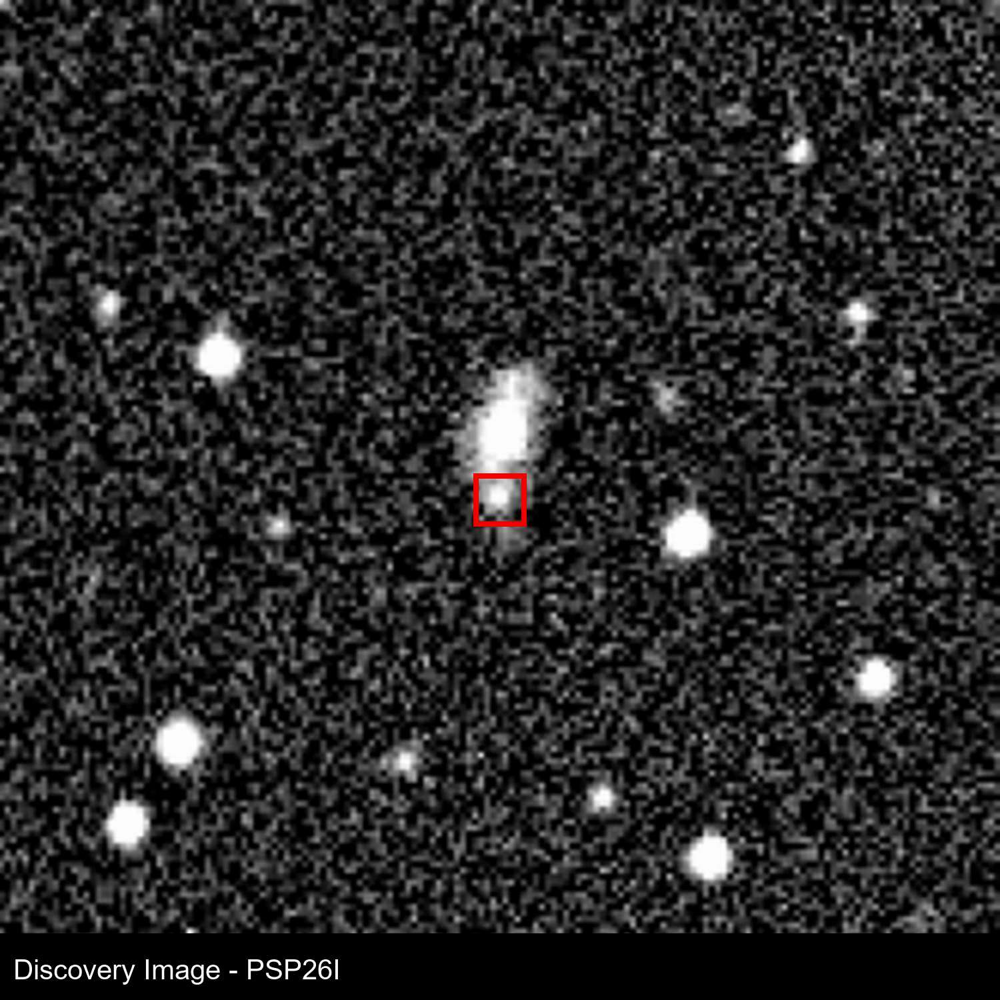 
Discovery image
</td>
<td align="center">
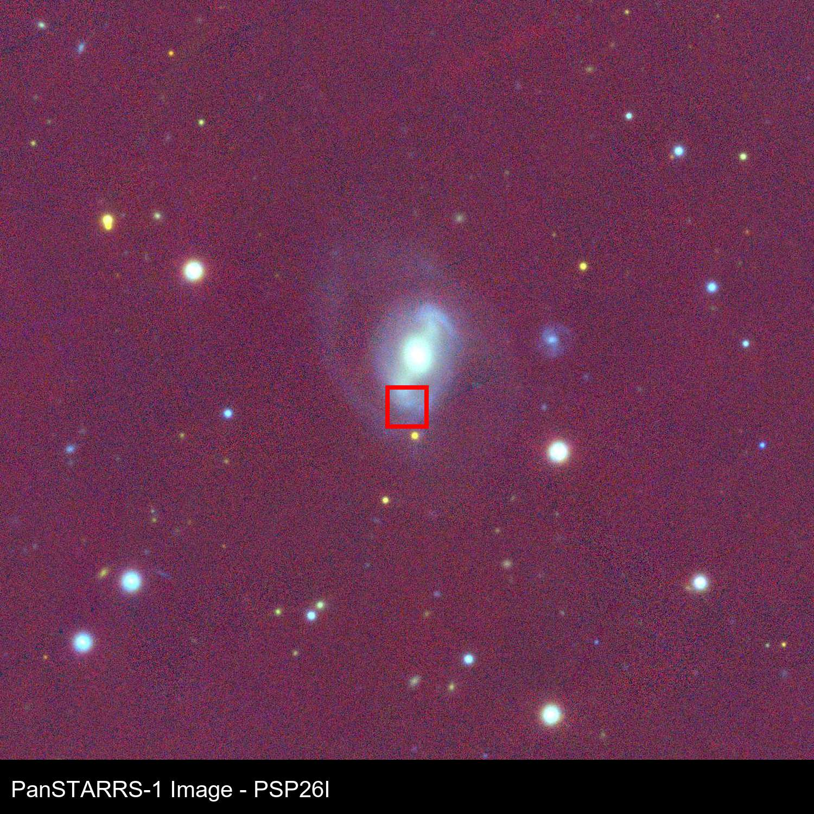 
Pan-STARRS1 reference image
</td>
</tr>
</table>

Source: [Xingming Observatory / XOSS](https://xjltp.china-vo.org/psp26i.html)

Public NADC report covering this discovery:

- 2026-03-27 — 《NADC运营的PSP项目2026年3月16日发现一颗II型超新星》 — [nadc.china-vo.org](https://nadc.china-vo.org/article/20260326111943)

---

## AT 2026rej — PSP26L

|  |  |
| --- | --- |
| Discovery date | 2026-07-02 |
| Coordinates (J2000) | 22:50:47.36 +10:44:06.8 |
| Classification | See public record |
| Public records | [TNS 2026rej](https://www.wis-tns.org/object/2026rej) · [AAVSO VSX](https://vsx.aavso.org/index.php?view=detail.top&oid=10875928) |

The public entries for this object do not settle on a single classification. See the TNS and VSX records.

<table>
<tr>
<td align="center">
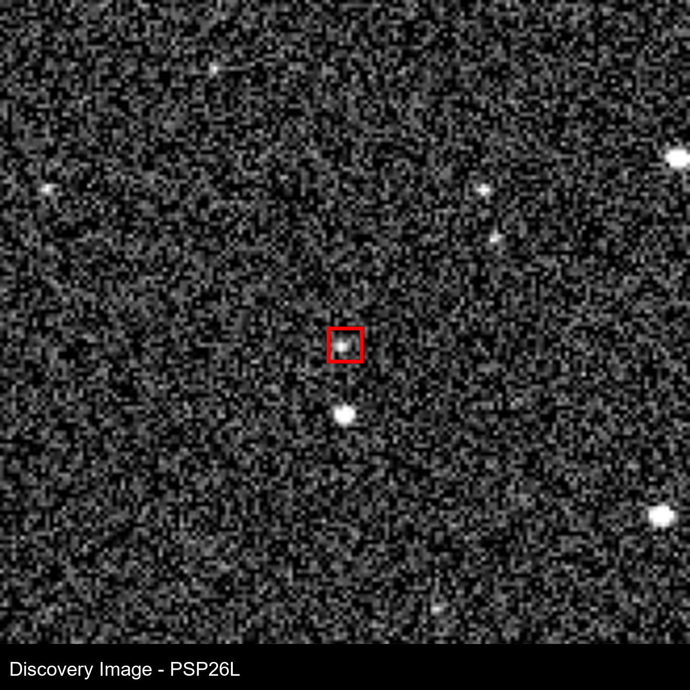 
Discovery image
</td>
<td align="center">
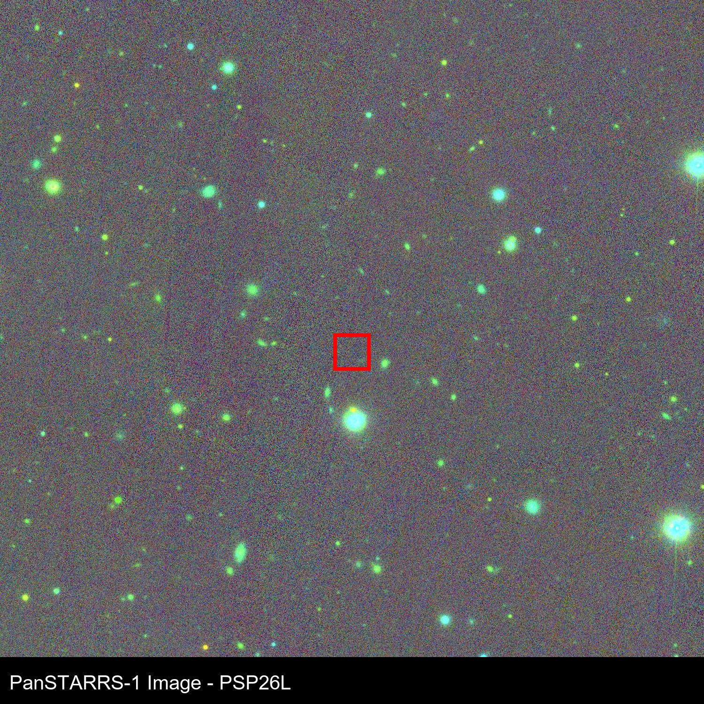 
Pan-STARRS1 reference image
</td>
</tr>
</table>

Source: [Xingming Observatory / XOSS](https://xjltp.china-vo.org/psp26l.html)

---

## AT 2026yoo — PSP26N

|  |  |
| --- | --- |
| Discovery date | 2026-08-11 |
| Coordinates (J2000) | 02:26:32.49 +31:56:15.6 |
| Classification | UG (as recorded by AAVSO VSX) |
| Public records | [TNS 2026yoo](https://www.wis-tns.org/object/2026yoo) · [AAVSO VSX](https://vsx.aavso.org/index.php?view=detail.top&oid=10875983) |

<table>
<tr>
<td align="center">
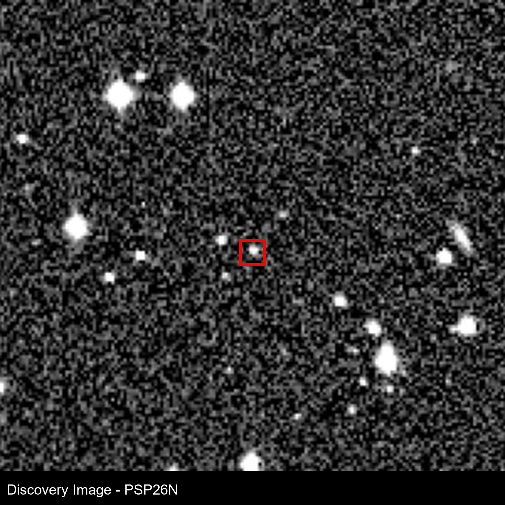 
Discovery image
</td>
<td align="center">
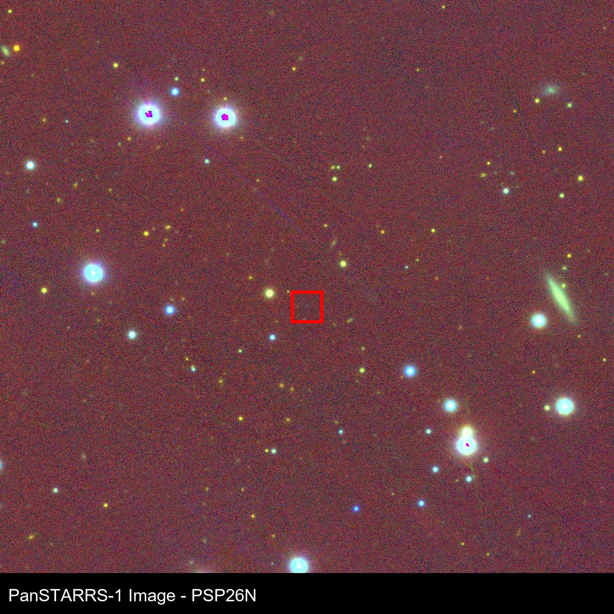 
Pan-STARRS1 reference image
</td>
</tr>
</table>

Source: [Xingming Observatory / XOSS](https://xjltp.china-vo.org/psp26n.html)

---

## AT 2026zgy — PSP26O

|  |  |
| --- | --- |
| Discovery date | 2026-08-19 |
| Coordinates (J2000) | 20:03:13.28 +14:10:23.8 |
| Classification | UG (as recorded by AAVSO VSX) |
| Public records | [TNS 2026zgy](https://www.wis-tns.org/object/2026zgy) · [AAVSO VSX](https://vsx.aavso.org/index.php?view=detail.top&oid=10875987) |

<table>
<tr>
<td align="center">
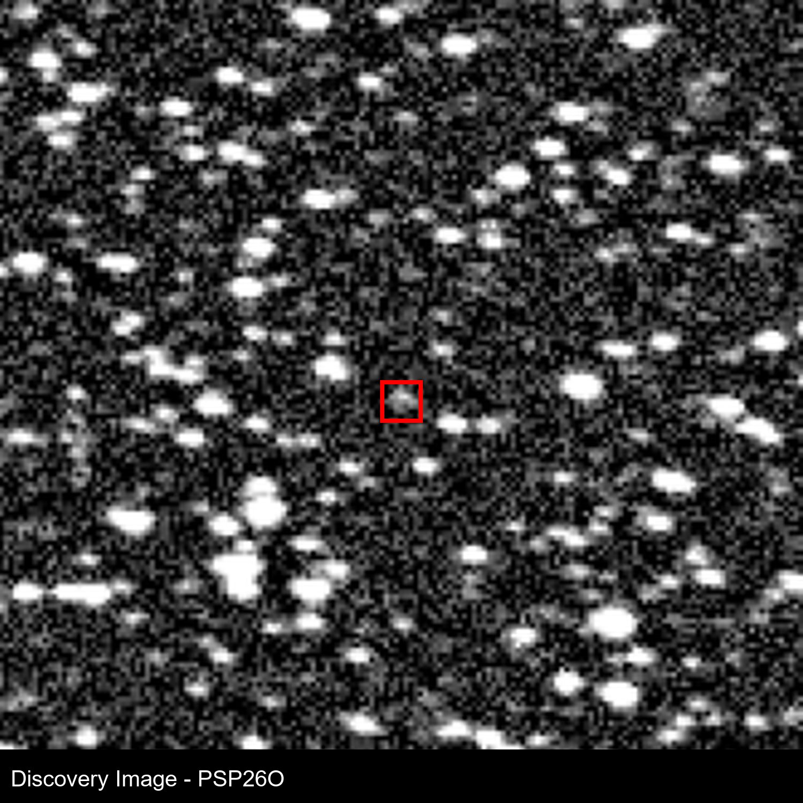 
Discovery image
</td>
<td align="center">
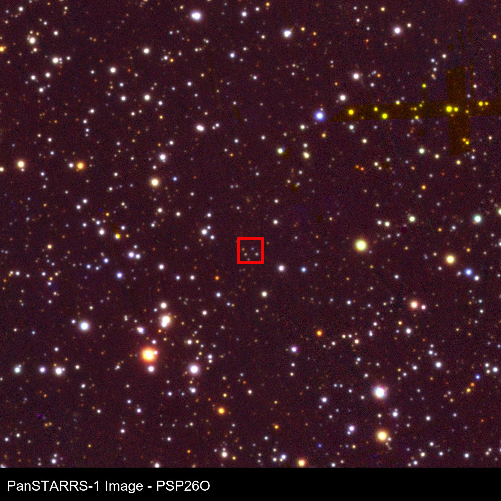 
Pan-STARRS1 reference image
</td>
</tr>
</table>

Source: [Xingming Observatory / XOSS](https://xjltp.china-vo.org/psp26o.html)

---

## SN 2026zkk — PSP26P

|  |  |
| --- | --- |
| Discovery date | 2026-08-19 |
| Coordinates (J2000) | 22:45:35.83 +38:33:43.08 |
| Classification | SN Ia-91T-like |
| Public records | [TNS 2026zkk](https://www.wis-tns.org/object/2026zkk) |

<table>
<tr>
<td align="center">
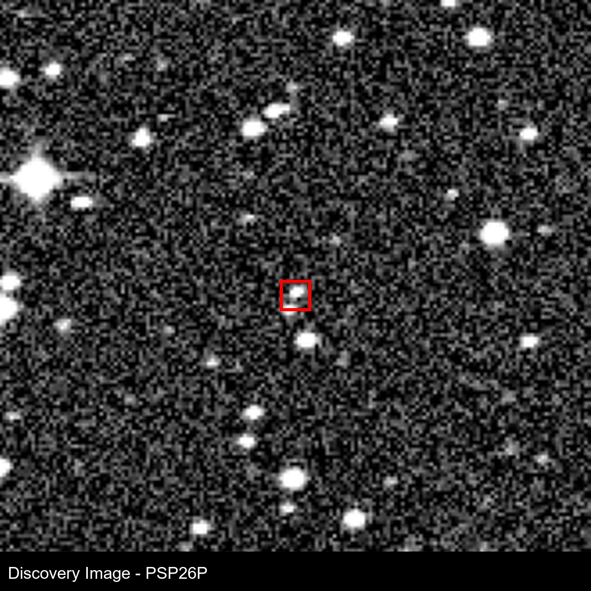 
Discovery image
</td>
<td align="center">
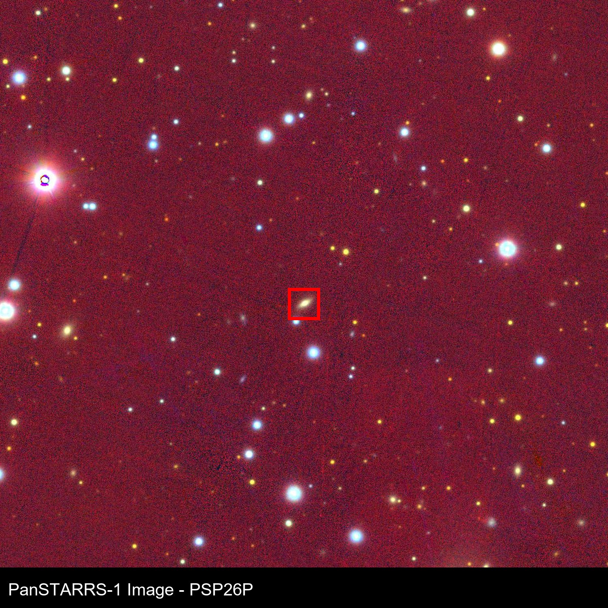 
Pan-STARRS1 reference image
</td>
</tr>
</table>

Source: [Xingming Observatory / XOSS](https://xjltp.china-vo.org/psp26p.html)

Public NADC report covering this discovery (together with SN 2026zwj):

- 2026-09-08 — 《2026年8月中下旬PSP发现两颗超新星》 — [nadc.china-vo.org](https://nadc.china-vo.org/article/20260908114017)

---

## SN 2026zwj — PSP26Q

|  |  |
| --- | --- |
| Discovery date | 2026-08-26 |
| Coordinates (J2000) | 02:09:26.85 +37:15:39.3 |
| Classification | SN IIP |
| Public records | [TNS 2026zwj](https://www.wis-tns.org/object/2026zwj) |

<table>
<tr>
<td align="center">
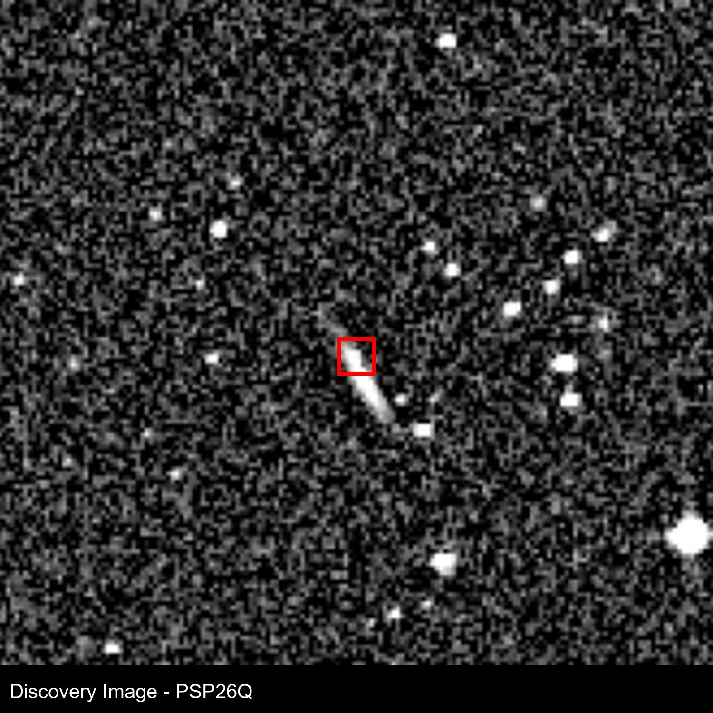 
Discovery image
</td>
<td align="center">
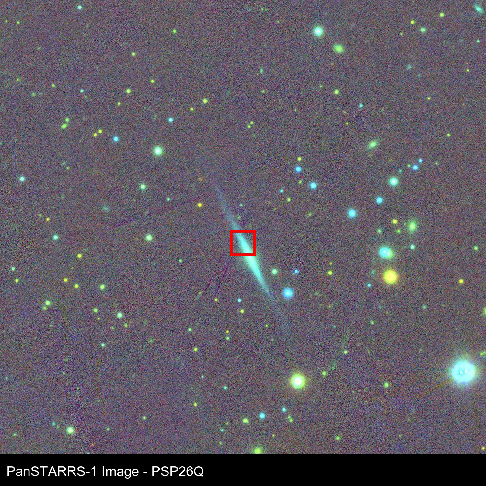 
Pan-STARRS1 reference image
</td>
</tr>
</table>

Source: [Xingming Observatory / XOSS](https://xjltp.china-vo.org/psp26q.html)

Public NADC report covering this discovery (together with SN 2026zkk):

- 2026-09-08 — 《2026年8月中下旬PSP发现两颗超新星》 — [nadc.china-vo.org](https://nadc.china-vo.org/article/20260908114017)

---

## AT 2026abmx — PSP26T

|  |  |
| --- | --- |
| Discovery date | 2026-09-13 |
| Coordinates (J2000) | 03:23:26.13 +42:48:28.2 |
| Classification | UGSS (as recorded by AAVSO VSX) |
| Public records | [TNS 2026abmx](https://www.wis-tns.org/object/2026abmx) · AAVSO VSX |

AAVSO VSX records this object as `UGSS`. Its VSX record identifier has not been confirmed, so only the TNS entry is linked.

<table>
<tr>
<td align="center">
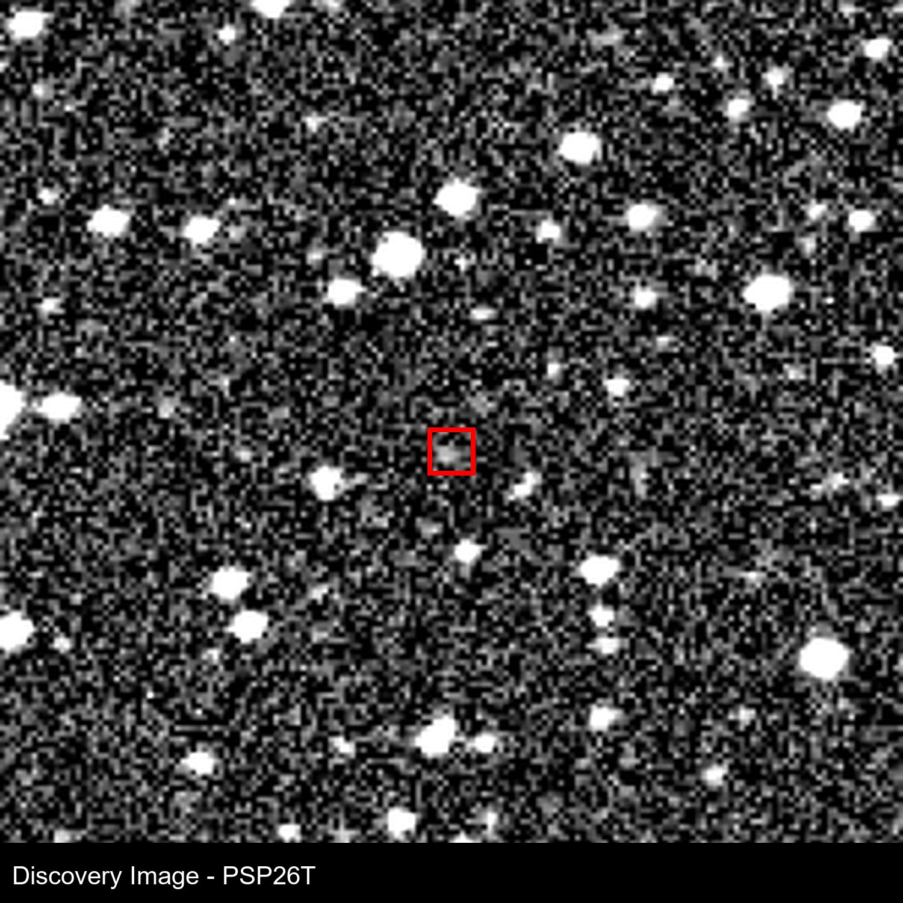 
Discovery image
</td>
<td align="center">
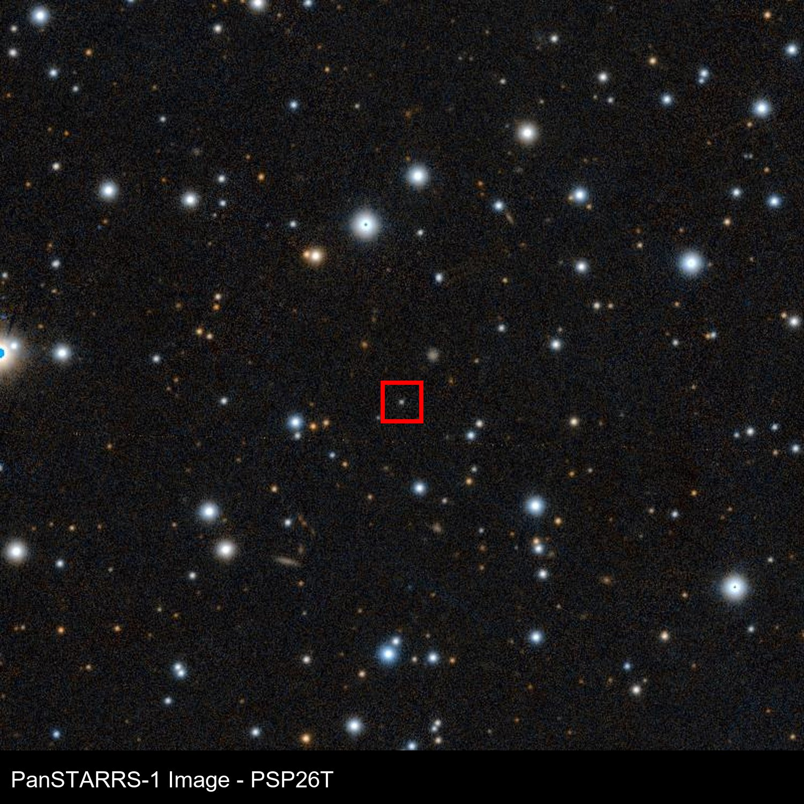 
Pan-STARRS1 reference image
</td>
</tr>
</table>

Source: [Xingming Observatory / XOSS](https://xjltp.china-vo.org/psp26t.html)

---

## Public references

| Source | Coverage |
| --- | --- |
| [Transient Name Server (TNS)](https://www.wis-tns.org/) | Object registration, reporting, and classification records for all objects above |
| [AAVSO International Variable Star Index (VSX)](https://vsx.aavso.org/) | Variable-star records for AT 2026rej, AT 2026yoo, AT 2026zgy, AT 2026abmx |
| [National Astronomical Data Center (NADC)](https://nadc.china-vo.org/) | Official public reports listed above |
| [Xingming Observatory / XOSS](https://xjltp.china-vo.org/) | Discovery and reference images listed above |
